# ResearchOS — Gofran's Implementation Defense Guide

> **Module & Scope**: **Authentication, Authorization (RBAC), Security Architecture, User Management & Admin Governance**  
> **Author / Contributor**: Abdul Gofran Emon  
> **Purpose**: This document provides a file-by-file technical breakdown of all backend and frontend components implemented by Gofran. It includes architectural rationale, code walkthroughs, data flow diagrams, and a defense presentation script for academic evaluation.

---

## 📑 Table of Contents
1. [Executive Summary & Contribution Overview](#-1-executive-summary--contribution-overview)
2. [Architecture & Request Lifecycle](#-2-architecture--request-lifecycle)
3. [Backend Implementation Breakdown (`apps/api/src/`)](#-3-backend-implementation-breakdown-appsapisrc)
4. [Frontend Implementation Breakdown (`apps/web/src/`)](#-4-frontend-implementation-breakdown-appswebsrc)
5. [Automated Testing & Verification](#-5-automated-testing--verification)
6. [Teacher Presentation & Viva Defense Script](#-6-teacher-presentation--viva-defense-script)

---

## 🌟 1. Executive Summary & Contribution Overview

Gofran was responsible for engineering the **security, identity, and governance backbone** of ResearchOS. This spans end-to-end user authentication, cryptographic token verification, live Role-Based Access Control (RBAC), fine-grained workspace and paper ownership guards, administrator moderation workflows, scholar profiles, and comprehensive automated test suites across both backend and frontend.

### Summary Matrix of Gofran's Files:

| Area | File Path | Core Responsibility |
| :--- | :--- | :--- |
| **Backend Core** | [`apps/api/src/index.ts`](file:///c:/Users/Abdul%20Gofran%20Emon/ResearchOS/apps/api/src/index.ts) | Server initialization, CORS, health check endpoint, route mounting |
| **Backend DB** | [`apps/api/src/supabase.ts`](file:///c:/Users/Abdul%20Gofran%20Emon/ResearchOS/apps/api/src/supabase.ts) | Privileged server-side Supabase client (`SUPABASE_SECRET_KEY`) |
| **Backend Auth** | [`apps/api/src/middleware/auth.ts`](file:///c:/Users/Abdul%20Gofran%20Emon/ResearchOS/apps/api/src/middleware/auth.ts) | Cryptographic JWKS JWT verification, live profile lookup, `requireRole`, `requireStatus` |
| **Backend Guards**| [`apps/api/src/middleware/workspaceGuards.ts`](file:///c:/Users/Abdul%20Gofran%20Emon/ResearchOS/apps/api/src/middleware/workspaceGuards.ts) | Project ownership & membership authorization ("Ownership beats Role") |
| **Backend Guards**| [`apps/api/src/middleware/paperGuards.ts`](file:///c:/Users/Abdul%20Gofran%20Emon/ResearchOS/apps/api/src/middleware/paperGuards.ts) | Literature & PDF access control, upload authorization |
| **Backend Routes**| [`apps/api/src/routes/admin.routes.ts`](file:///c:/Users/Abdul%20Gofran%20Emon/ResearchOS/apps/api/src/routes/admin.routes.ts) | Admin console API (supervisor verification, role changes, suspensions) |
| **Backend Routes**| [`apps/api/src/routes/profile.routes.ts`](file:///c:/Users/Abdul%20Gofran%20Emon/ResearchOS/apps/api/src/routes/profile.routes.ts) | Profile retrieval (`/me`), sanitized profile updates, user search |
| **Backend Services**| [`apps/api/src/services/audit.service.ts`](file:///c:/Users/Abdul%20Gofran%20Emon/ResearchOS/apps/api/src/services/audit.service.ts) | Immutable platform audit logging for administrative actions |
| **Backend Scripts**| [`apps/api/src/scripts/seed.ts`](file:///c:/Users/Abdul%20Gofran%20Emon/ResearchOS/apps/api/src/scripts/seed.ts) | Automated seed script creating demo accounts for all three roles |
| **Backend Types** | [`apps/api/src/types/express.d.ts`](file:///c:/Users/Abdul%20Gofran%20Emon/ResearchOS/apps/api/src/types/express.d.ts) | TypeScript declaration merging for typed `req.user` & `req.userId` |
| **Backend Tests** | [`apps/api/src/tests/auth-rbac.test.ts`](file:///c:/Users/Abdul%20Gofran%20Emon/ResearchOS/apps/api/src/tests/auth-rbac.test.ts) | Automated test suite verifying 401s, 403s, role & status transitions |
| **Frontend DB** | [`apps/web/src/supabase.ts`](file:///c:/Users/Abdul%20Gofran%20Emon/ResearchOS/apps/web/src/supabase.ts) | Restricted browser Supabase client (`VITE_SUPABASE_PUBLISHABLE_KEY`) |
| **Frontend State**| [`apps/web/src/context/AuthContext.tsx`](file:///c:/Users/Abdul%20Gofran%20Emon/ResearchOS/apps/web/src/context/AuthContext.tsx) | Global React Auth state, session lifecycle, login, signup, Google OAuth |
| **Frontend Pages**| [`apps/web/src/pages/auth/LoginPage.tsx`](file:///c:/Users/Abdul%20Gofran%20Emon/ResearchOS/apps/web/src/pages/auth/LoginPage.tsx) | Login page with Google SSO & test account quick-switcher |
| **Frontend Pages**| [`apps/web/src/pages/auth/SignupPage.tsx`](file:///c:/Users/Abdul%20Gofran%20Emon/ResearchOS/apps/web/src/pages/auth/SignupPage.tsx) | Registration with role selection & institutional details |
| **Frontend Pages**| [`apps/web/src/pages/auth/ForgotPasswordPage.tsx`](file:///c:/Users/Abdul%20Gofran%20Emon/ResearchOS/apps/web/src/pages/auth/ForgotPasswordPage.tsx) | Password recovery request UI |
| **Frontend Pages**| [`apps/web/src/pages/auth/ResetPasswordPage.tsx`](file:///c:/Users/Abdul%20Gofran%20Emon/ResearchOS/apps/web/src/pages/auth/ResetPasswordPage.tsx) | Password update interface after reset link |
| **Frontend Pages**| [`apps/web/src/pages/auth/CompleteProfilePage.tsx`](file:///c:/Users/Abdul%20Gofran%20Emon/ResearchOS/apps/web/src/pages/auth/CompleteProfilePage.tsx) | First-time Google OAuth onboarding & role assignment form |
| **Frontend Pages**| [`apps/web/src/pages/dashboards/AdminConsolePage.tsx`](file:///c:/Users/Abdul%20Gofran%20Emon/ResearchOS/apps/web/src/pages/dashboards/AdminConsolePage.tsx) | Admin dashboard: verification queue, user management, audit viewer |
| **Frontend Pages**| [`apps/web/src/pages/dashboards/ProfilePage.tsx`](file:///c:/Users/Abdul%20Gofran%20Emon/ResearchOS/apps/web/src/pages/dashboards/ProfilePage.tsx) | Scholar profile management (ORCID, Google Scholar, bio, skills) |
| **Frontend Tests**| [`apps/web/src/tests/auth-rbac-ui.test.tsx`](file:///c:/Users/Abdul%20Gofran%20Emon/ResearchOS/apps/web/src/tests/auth-rbac-ui.test.tsx) | UI test suite checking form renders, role selections, and guard states |

---

## 🔄 2. Architecture & Request Lifecycle

Gofran implemented a **multi-tiered security pipeline** that guarantees zero unauthorized access and prevents client-side role forgery.

```mermaid
sequenceDiagram
    autonumber
    actor User as Scholar (Browser)
    participant AuthCtx as React AuthContext
    participant Express as Express API (apps/api)
    participant JWKS as In-Memory JWKS Cache (jose)
    participant DB as Supabase PostgreSQL

    User->>AuthCtx: Login / Google OAuth
    AuthCtx->>DB: Authenticate via Supabase Auth
    DB-->>AuthCtx: Return JWT Token (with user ID in 'sub')
    
    Note over User,Express: Making a Protected API Request
    User->>Express: GET /projects/:projectId (Header: Bearer <JWT>)
    
    rect rgb(20, 25, 45)
        Note over Express,JWKS: 1. Authentication Layer (middleware/auth.ts)
        Express->>JWKS: Verify JWT signature against cached public keys
        JWKS-->>Express: Token Valid (Payload contains sub = userId)
        Express->>DB: Live lookup in public.profiles for userId
        DB-->>Express: Returns { role: 'Researcher', status: 'Active' }
    end

    rect rgb(30, 20, 45)
        Note over Express,DB: 2. Authorization & Ownership Layer (middleware/workspaceGuards.ts)
        Express->>Express: Check requireStatus('Active') -> PASSED
        Express->>DB: Check if userId is Project Owner or in project_members
        DB-->>Express: Access confirmed (Project Member)
    end

    Express->>DB: Fetch project data using Supabase Secret Key
    DB-->>Express: Return project records
    Express-->>User: 200 OK + Project JSON payload
```



---

## ⚙️ 3. Backend Implementation Breakdown (`apps/api/src/`)

### 1. [`index.ts`](file:///c:/Users/Abdul%20Gofran%20Emon/ResearchOS/apps/api/src/index.ts) — Server Entrypoint & Route Mounting
* **What Gofran built**:
  * Configured the central Express application, CORS origins (`http://localhost:5173`), JSON body parsers, and error handling middleware.
  * Implemented the **System Health Check Endpoint** (`GET /health`) that checks both server uptime and live Supabase connectivity.
  * Cleanly mounted all modular route controllers (`profileRoutes`, `adminRoutes`, `projectRoutes`, `paperRoutes`, etc.).

---

### 2. [`supabase.ts`](file:///c:/Users/Abdul%20Gofran%20Emon/ResearchOS/apps/api/src/supabase.ts) — Secure Backend Database Client
* **What Gofran built**:
  * Initialized the administrative Supabase client (`supabaseAdmin`) using the server-only `SUPABASE_SECRET_KEY` (service role).
  * Configured `autoRefreshToken: false` and `persistSession: false` since the backend operates statelessly per incoming HTTP request.
  * Ensures that database operations verified by Express middleware can execute without Row Level Security circular blocks.

---

### 3. [`middleware/auth.ts`](file:///c:/Users/Abdul%20Gofran%20Emon/ResearchOS/apps/api/src/middleware/auth.ts) — Authentication & Live RBAC Engine
* **What Gofran built**:
  * **JWKS Caching**: Utilized `createRemoteJWKSet()` from the `jose` library to fetch and cache Supabase's public keys. This validates JWT signatures cryptographically in sub-milliseconds without database load.
  * **Live Profile Lookup**: Extracting `userId` from the token's `sub` claim and querying `public.profiles` directly. This prevents attacks where a user tampers with JWT metadata to claim an `Admin` or `Supervisor` role.
  * **Account Status Enforcement**: Immediately rejects suspended users (`status === 'Suspended'`) with a `403 Forbidden`.
  * **Role Guards (`requireRole`)**: Higher-order middleware allowing only designated roles (e.g. `requireRole('Admin')` or `requireRole('Supervisor', 'Admin')`).
  * **Status Guards (`requireStatus`)**: Rejects unverified accounts from performing sensitive actions (e.g., `PendingVerification` supervisors cannot create public projects until approved).

```typescript
// apps/api/src/middleware/auth.ts (Snippet)
export async function authenticate(req: Request, res: Response, next: NextFunction) {
  const authHeader = req.headers.authorization;
  if (!authHeader?.startsWith('Bearer ')) {
    return res.status(401).json({ error: 'Missing or malformed Authorization header' });
  }

  const token = authHeader.split(' ')[1];
  try {
    const { payload } = await jwtVerify(token, JWKS);
    const userId = payload.sub;

    const { data: dbProfile } = await supabaseAdmin
      .from('profiles')
      .select('*')
      .eq('id', userId)
      .single();

    if (!dbProfile || dbProfile.status === 'Suspended') {
      return res.status(403).json({ error: 'Account suspended or profile missing' });
    }

    req.user = mapDbProfileToProfile(dbProfile);
    req.userId = userId;
    return next();
  } catch (err) {
    return res.status(401).json({ error: 'Invalid or expired JWT token' });
  }
}
```

---

### 4. [`middleware/workspaceGuards.ts`](file:///c:/Users/Abdul%20Gofran%20Emon/ResearchOS/apps/api/src/middleware/workspaceGuards.ts) — Ownership & Scope Authorization
* **What Gofran built**:
  * Implemented the rule **"Ownership beats Role"**: Having a `Supervisor` role does not grant automatic access to another scholar's private research workspace.
  * **`requireProjectMember()`**: Validates if `req.userId` matches `projects.owner_id` OR exists as an active member in `project_members`. Attaches typed `req.projectAccess` to downstream handlers.
  * **`requireProjectOwner()`**: Restricts destructive operations (e.g. deleting a project or archiving milestones) strictly to the project creator.

---

### 5. [`middleware/paperGuards.ts`](file:///c:/Users/Abdul%20Gofran%20Emon/ResearchOS/apps/api/src/middleware/paperGuards.ts) — Literature & Document Access Control
* **What Gofran built**:
  * Validates access permissions before reading, annotating, or deleting research papers and PDF files.
  * Verifies if a paper is public, directly owned by the user, or part of a shared project workspace where the user is an active member.

---

### 6. [`routes/admin.routes.ts`](file:///c:/Users/Abdul%20Gofran%20Emon/ResearchOS/apps/api/src/routes/admin.routes.ts) — Admin Governance & Verification API
* **What Gofran built**:
  * Fully secured under `authenticate`, `requireStatus('Active')`, and `requireRole('Admin')`.
  * **`GET /admin/supervisor-verifications`**: Lists pending supervisor verification requests with uploaded academic credentials.
  * **`POST /admin/supervisor-verifications/:id/approve`**: Approves supervisor credentials, updates status to `Active`, and logs an audit record.
  * **`POST /admin/supervisor-verifications/:id/reject`**: Rejects invalid supervisor credentials with a reason message.
  * **`PATCH /admin/users/:userId/role`**: Allows platform administrators to promote or demote user roles (`Researcher` ↔ `Supervisor` ↔ `Admin`).
  * **`PATCH /admin/users/:userId/status`**: Allows suspending malicious accounts or reactivating suspended users.
  * **`GET /admin/audit-logs`**: Returns paginated system audit logs.

---

### 7. [`routes/profile.routes.ts`](file:///c:/Users/Abdul%20Gofran%20Emon/ResearchOS/apps/api/src/routes/profile.routes.ts) — Profile & Search API
* **What Gofran built**:
  * **`GET /me`**: Returns the live profile of the authenticated user.
  * **`PATCH /me`**: Sanitizes and updates personal details (bio, ORCID URL, Google Scholar URL, department, skills) while strictly rejecting client attempts to overwrite protected fields (`role`, `status`, `id`).
  * **`GET /profiles/search?q=...`**: Search engine for finding researchers by name, institution, or field tags to invite into collaborative workspaces.

---

### 8. [`services/audit.service.ts`](file:///c:/Users/Abdul%20Gofran%20Emon/ResearchOS/apps/api/src/services/audit.service.ts) — Security Audit Trail
* **What Gofran built**:
  * Provides a centralized, resilient logging function `createAuditLog()`.
  * Persists immutable records in `public.audit_logs` tracking the actor ID, action name (e.g. `USER_ROLE_CHANGED`, `SUPERVISOR_VERIFIED`), target entity, IP address, and metadata.

---

### 9. [`scripts/seed.ts`](file:///c:/Users/Abdul%20Gofran%20Emon/ResearchOS/apps/api/src/scripts/seed.ts) — Development & Demo Seed Script
* **What Gofran built**:
  * Automated TypeScript script to bootstrap the database with standard test accounts:
    * `researcher@mit.edu` (`Researcher`, `Active`)
    * `supervisor@stanford.edu` (`Supervisor`, `Active`)
    * `supervisor.pending@oxford.edu` (`Supervisor`, `PendingVerification`)
    * `admin@researchos.edu` (`Admin`, `Active`)
  * Generates sample projects, milestone schedules, tasks, and verification requests for instant demo readiness.

---

### 10. [`types/express.d.ts`](file:///c:/Users/Abdul%20Gofran%20Emon/ResearchOS/apps/api/src/types/express.d.ts) — Request Augmentation
* **What Gofran built**:
  * Extended Express's global `Request` interface to natively type `req.user` (`Profile`) and `req.userId` (`string`), eliminating unsafe type casting (`as any`) throughout all backend routes.

---

## 💻 4. Frontend Implementation Breakdown (`apps/web/src/`)

### 1. [`supabase.ts`](file:///c:/Users/Abdul%20Gofran%20Emon/ResearchOS/apps/web/src/supabase.ts) — Frontend Supabase Client
* **What Gofran built**:
  * Initialized the browser Supabase client with `VITE_SUPABASE_PUBLISHABLE_KEY`.
  * Configured session persistence (`persistSession: true`) and URL token detection (`detectSessionInUrl: true`) for seamless OAuth redirects.
  * Adheres strictly to architectural rules: strictly reserved for Auth, Storage uploads, and Realtime subscriptions.

---

### 2. [`context/AuthContext.tsx`](file:///c:/Users/Abdul%20Gofran%20Emon/ResearchOS/apps/web/src/context/AuthContext.tsx) — Central Authentication State
* **What Gofran built**:
  * Engineered the `AuthProvider` and `useAuth()` hook managing `user`, `session`, `profile`, and `loading` states across the React tree.
  * **`signInWithGoogle()`**: Initiates Google OAuth 2.0 flow with redirect to `/complete-profile`.
  * **`signUp()`**: Registers new users with custom metadata (`roleRequest`, `institution`, `department`).
  * **`fetchProfile()`**: Automatically synchronizes live role and status from Express API (`/me`) on login and on token changes.

---

### 3. Auth Page Suite (`apps/web/src/pages/auth/`)
* **[`LoginPage.tsx`](file:///c:/Users/Abdul%20Gofran%20Emon/ResearchOS/apps/web/src/pages/auth/LoginPage.tsx)**:
  * Institutional email/password login form.
  * One-click **Google OAuth Single Sign-On** button.
  * **Demo Test Credentials Quick-Switcher**: A toolbar allowing instant switching between Researcher, Supervisor, and Admin personas during evaluations and presentations.
* **[`SignupPage.tsx`](file:///c:/Users/Abdul%20Gofran%20Emon/ResearchOS/apps/web/src/pages/auth/SignupPage.tsx)**:
  * Role selection cards (`Researcher` vs `Supervisor`).
  * Dynamic guidance explaining that Supervisor accounts require institutional faculty verification before full workspace access.
* **[`CompleteProfilePage.tsx`](file:///c:/Users/Abdul%20Gofran%20Emon/ResearchOS/apps/web/src/pages/auth/CompleteProfilePage.tsx)**:
  * Onboarding form presented to first-time Google OAuth users to finalize their academic role, institution, and research tags.
* **[`ForgotPasswordPage.tsx`](file:///c:/Users/Abdul%20Gofran%20Emon/ResearchOS/apps/web/src/pages/auth/ForgotPasswordPage.tsx)** & **[`ResetPasswordPage.tsx`](file:///c:/Users/Abdul%20Gofran%20Emon/ResearchOS/apps/web/src/pages/auth/ResetPasswordPage.tsx)**:
  * Full self-service password recovery flow with client-side password strength validation.

---

### 4. Role Dashboards & Management Pages
* **[`pages/dashboards/AdminConsolePage.tsx`](file:///c:/Users/Abdul%20Gofran%20Emon/ResearchOS/apps/web/src/pages/dashboards/AdminConsolePage.tsx)**:
  * **Supervisor Verification Queue**: Review uploaded faculty ID cards/letters, approve with one click, or reject with custom feedback.
  * **User Account Management**: Search any registered user and modify their application role (`Researcher` ↔ `Supervisor` ↔ `Admin`) or account status (`Active` / `Suspended`).
  * **System Audit Log Viewer**: Live feed of security and role transition events.
* **[`pages/dashboards/ProfilePage.tsx`](file:///c:/Users/Abdul%20Gofran%20Emon/ResearchOS/apps/web/src/pages/dashboards/ProfilePage.tsx)**:
  * Scholar identity page allowing editing of bio, institutional affiliation, department, ORCID profile link, Google Scholar link, research tags, and skills.

---

## 🧪 5. Automated Testing & Verification

Gofran authored comprehensive test suites on both the backend and frontend to verify that security rules cannot be breached:

### 1. Backend RBAC Test Suite ([`apps/api/src/tests/auth-rbac.test.ts`](file:///c:/Users/Abdul%20Gofran%20Emon/ResearchOS/apps/api/src/tests/auth-rbac.test.ts))
* **Tests Implemented**:
  1. `401 Unauthorized` when no Authorization header is provided.
  2. `401 Unauthorized` when token is malformed, expired, or signed with an untrusted key.
  3. `403 Forbidden` when a `Researcher` attempts to access Admin verification routes (`/admin/supervisor-verifications`).
  4. `403 Forbidden` when a `Supervisor` with status `PendingVerification` attempts restricted actions.
  5. `403 Forbidden` when an account with status `Suspended` makes any request.
  6. Happy-path verification: Admin users successfully approve/reject supervisor requests and record audit logs.

### 2. Frontend UI Test Suite ([`apps/web/src/tests/auth-rbac-ui.test.tsx`](file:///c:/Users/Abdul%20Gofran%20Emon/ResearchOS/apps/web/src/tests/auth-rbac-ui.test.tsx))
* **Tests Implemented**:
  1. `LoginPage` renders email/password inputs, Google SSO button, and demo persona fast-switcher.
  2. `SignupPage` renders interactive role selection with faculty verification warnings.
  3. `CompleteProfilePage` renders Google OAuth onboarding form.
  4. `AdminConsolePage` displays supervisor queue and user role selector.
  5. `ProfilePage` renders ORCID, Scholar, and profile editing fields.

---

## 🎤 6. Teacher Presentation & Viva Defense Script

When your teacher asks you about your contribution, you can present your work using this structured script:

---

### Opening Statement:
> *"In ResearchOS, I engineered the entire **Security, Authentication, RBAC, and Administrative Governance system** across both the backend and frontend. My primary objective was to ensure that institutional research data remains strictly protected, that identity authentication is seamless via both Password and Google SSO, and that access permissions follow an unbreakable 'Ownership Beats Role' model."*

---

### Key Questions & Model Answers:

#### Q1: "What did you do on the backend?"
> **Answer**:  
> *"On the backend (`apps/api`), I built:  
> 1. The **Authentication Middleware** (`auth.ts`) which verifies incoming Supabase JWTs using cached JWKS public keys (`jose` library) and queries `public.profiles` for the user's real-time role and status.  
> 2. The **RBAC & Status Guards** (`requireRole`, `requireStatus`) that protect sensitive routes.  
> 3. The **Workspace & Paper Ownership Guards** (`workspaceGuards.ts`, `paperGuards.ts`), guaranteeing that a Supervisor cannot access another researcher's private workspace unless explicitly added as a collaborator.  
> 4. The **Admin Governance API** (`admin.routes.ts`) for supervisor verification, account suspensions, and role management with immutable **Audit Logging** (`audit.service.ts`).  
> 5. The **Profile API** (`profile.routes.ts`) and the full **Backend Automated Test Suite** (`auth-rbac.test.ts`)."*

---

#### Q2: "What did you do on the frontend?"
> **Answer**:  
> *"On the frontend (`apps/web`), I built:  
> 1. The **Global Authentication Context** (`AuthContext.tsx`) that tracks session states and handles Google Cloud OAuth 2.0 integration and email logins.  
> 2. The complete **Authentication UI Suite** (`LoginPage.tsx`, `SignupPage.tsx`, `ForgotPasswordPage.tsx`, `ResetPasswordPage.tsx`, and `CompleteProfilePage.tsx`).  
> 3. A **Test Persona Switcher** on the login page for instantaneous role switching during evaluations.  
> 4. The **Admin Console Dashboard** (`AdminConsolePage.tsx`) for reviewing supervisor ID verification documents and managing user permissions.  
> 5. The **Scholar Profile Page** (`ProfilePage.tsx`) and the **Frontend UI Test Suite** (`auth-rbac-ui.test.tsx`)."*

---

#### Q3: "Why didn't you just trust the role stored inside the JWT token?"
> **Answer**:  
> *"Trusting role claims inside a JWT is a known security vulnerability because JWT claims are static until token expiry (usually 1 hour). If an administrator suspends a user or revokes their supervisor privileges, a static token would allow them to continue making privileged calls. In my implementation in `auth.ts`, the JWT only authenticates the user's identity (`userId`), while the role and status are dynamically looked up in `public.profiles`. This guarantees that suspensions and role changes take effect immediately."*
