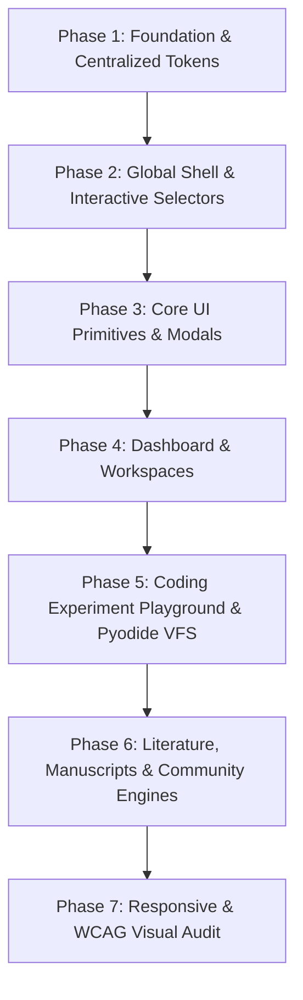

# ResearchOS — UI Readability & Typography Refinement Master Plan

> **Scope**: Visual & UX Readability Refinement Only  
> **Status**: Ready for Execution  
> **Target Package**: `apps/web` (`apps/web/src`)  
> **Rule Precedence**: `AGENTS.md` (Zero business logic, API, database, routing, or state machine changes)

---

## 1. Executive Summary & Objective

The objective of this refinement is to eliminate eye fatigue and make the entire ResearchOS platform comfortably readable for extended scholarly, scientific, and coding experimentation sessions, while **strictly preserving** the signature **Deep Cosmic Obsidian & Radiant Violet Glassmorphism** design language.

### Core Goals:
1. **Elevate Text Contrast**: Ensure secondary and muted text comfortably meets or exceeds WCAG 2.1 AA standards (minimum 4.5:1 for normal text) against dark canvas (`#07070C`) and surface cards (`#0D0C18`, `#131224`, `#1B1832`).
2. **Standardize Typography Scale**: Eradicate illegible micro-text (`text-[9px]`, `text-[10px]`, `text-[11px]`) across badges, buttons, headers, metadata, and dropdowns. Establish a consistent, comfortable typography hierarchy.
3. **Preserve & Polish Interactive Dropdown Selectors**: In the TopBar Project Switcher (`TopHeader.tsx`), `HoverSelect.tsx`, and filter dropdowns, preserve all existing hover triggers, closing bridge delays, keyboard access, and click selections while upgrading their visual clarity, font sizes, and badge contrasts.
4. **Encompass All Newly Implemented Features**: Include the entire **Coding Experiment Playground & Virtual File System** suite (`CodePlayground.tsx`, `FileTreeExplorer.tsx`, `EditorTabs.tsx`, `DatasetUploadModal.tsx`, `SaveRunAsExperimentModal.tsx`, etc.) to ensure complete platform-wide consistency.
5. **Preserve Layout Integrity**: Ensure text enlargement and line-height expansion do not cause container overflows, clipped text, wrapping failures, or broken responsive grids.

---

## 2. Root Cause Audit of Current Readability Issues

| Area | Current Implementation | Symptom / Problem | Targeted Remedy |
| :--- | :--- | :--- | :--- |
| **Global Theme Tokens** | CSS variables for text contrast (`--color-foreground`, `--color-muted-foreground`, etc.) are missing from `index.css`. | Hardcoded `text-slate-400` / `text-slate-500` used arbitrarily across files, rendering text washed-out on obsidian surfaces. | Define centralized semantic CSS variables in `index.css` and configure Tailwind theme tokens with verified contrast ratios. |
| **Sidebar Navigation** | `AppSidebar.tsx` uses `text-xs` (12px) with `text-slate-400` for navigation labels, and `text-[10px]` for badges and roles. | Navigation labels blend into the dark sidebar; active vs. inactive contrast is too subtle in collapsed/expanded states. | Upgrade nav labels to `text-sm font-medium` (`#E2E8F0` hover `#FFFFFF`), badges to `text-xs font-semibold`, and role titles to `text-xs font-medium`. |
| **Top Header & Project Switcher Popover** | `TopHeader.tsx` project dropdown contains `text-[9px]` project count and `text-[10px]` uppercase header. | Difficult to read during project switching; text is overly compressed. | Preserve hover/click mechanics; upgrade to `text-xs font-bold tracking-wider text-violet-300`, project item titles to `text-sm font-medium`, and role indicators to `text-xs`. |
| **Action Buttons** | Primary & secondary buttons across dashboards use `text-xs font-bold` (12px) with tight padding. | Buttons look like miniature pill tags rather than actionable controls; text is strained. | Elevate buttons to `text-sm font-semibold` (`14px`) with proportional padding (`px-4 py-2` or `px-5 py-2.5`). |
| **Coding Playground & Explorer (New Feature)** | `CodePlayground.tsx`, `FileTreeExplorer.tsx`, `EditorTabs.tsx` use dense 11px/12px fonts for tabs, file nodes, and metric badges. | Extended coding and debugging sessions in Pyodide VFS cause eye strain. | Standardize file tree nodes to `text-sm`, editor tab titles to `text-sm font-medium`, output terminal text to `text-xs/text-sm font-mono`, and metric values to `text-sm font-bold`. |
| **Dashboard Card Metadata** | Card subtext, stats, task counts, and tags frequently use `text-xs text-slate-400` or `text-[11px] text-slate-500`. | Critical academic metadata (DOIs, timestamps, experiment metrics) requires squinting. | Shift secondary text to `text-sm text-slate-300` and metadata floor to `text-xs text-slate-300` / `text-slate-200`. |
| **Form Inputs & Tables** | Placeholders, table headers, and inputs use low-contrast gray text with small sizes. | Data entry and scanning dense tables causes cognitive load. | Standardize table headers to `text-xs font-semibold text-slate-300 uppercase`, cell text to `text-sm text-slate-100`, inputs to `text-sm`. |

---

## 3. Standardized Typography & Contrast Specification

### 3.1 Typography Scale Reference Table

| Role | Tailwind Class | Desktop Size / Line-Height | Weight | Primary Color Token |
| :--- | :--- | :--- | :--- | :--- |
| **Hero / Page Title** | `text-2xl sm:text-3xl` | `28px - 32px` / `leading-tight` | `font-bold` | `#FFFFFF` (`text-white`) |
| **Section Heading** | `text-lg sm:text-xl` | `18px - 20px` / `leading-snug` | `font-bold` | `#FFFFFF` (`text-white`) |
| **Card / Modal Title** | `text-base font-semibold` | `16px` / `leading-snug` | `font-semibold` | `#F8FAFC` (`text-slate-50`) |
| **Body / Default Text**| `text-sm` | `14px` / `leading-relaxed` | `font-normal` | `#E2E8F0` (`text-slate-200`) |
| **Secondary Description**| `text-sm` | `14px` / `leading-relaxed` | `font-normal` | `#CBD5E1` (`text-slate-300`) |
| **Action Controls & Nav**| `text-sm` | `14px` / `leading-none` | `font-semibold` | Active: `#FFFFFF`, Inactive: `#E2E8F0` |
| **Code & Terminal Output**| `text-xs sm:text-sm font-mono`| `13px - 14px` / `leading-relaxed` | `font-normal` | `#F8FAFC` on terminal surface |
| **Supporting / Meta** | `text-xs` | `12px` / `leading-normal` | `font-medium` | `#94A3B8` / `#CBD5E1` |
| **Micro-Badges (Minimum)**| `text-xs` | `12px` (Never sub-12px) | `font-bold` | Contextual accent (`#C084FC`, `#38BDF8`) |

> **Hard Floor Rule**: No font size anywhere in the application shall be smaller than `12px` (`text-xs`). Any existing `text-[9px]`, `text-[10px]`, or `text-[11px]` must be migrated to `text-xs` (`12px`) with appropriate padding and tracking.

### 3.2 Contrast Targets on Obsidian Surfaces

| Element Surface | Background Hex | Text Token | Foreground Hex | Calculated Contrast | WCAG Rating |
| :--- | :--- | :--- | :--- | :--- | :--- |
| Canvas Background | `#07070C` | Primary Body | `#F8FAFC` | 17.5 : 1 | **AAA** (Pass) |
| Canvas Background | `#07070C` | Secondary Muted | `#CBD5E1` | 11.2 : 1 | **AAA** (Pass) |
| Card Glass Surface | `#131224` | Primary Heading | `#FFFFFF` | 16.2 : 1 | **AAA** (Pass) |
| Card Glass Surface | `#131224` | Secondary Text | `#E2E8F0` | 13.1 : 1 | **AAA** (Pass) |
| Card Glass Surface | `#131224` | Tertiary / Meta | `#94A3B8` | 6.8 : 1 | **AA** (Pass) |
| Pill Button Active | `#8B5CF6` | Button Text | `#FFFFFF` | 5.2 : 1 | **AA** (Pass) |
| Subtle Border | `#131224` | Border Subtle | `rgba(255,255,255,0.12)` | Clearly visible edge definition |

---

## 4. Phased Implementation Roadmap

### Phase 1: Foundation & Centralized Tokens
* **Files Affected**:
  - `apps/web/src/index.css`
  - `apps/web/tailwind.config.js`
* **Changes**:
  1. Add semantic text and border CSS custom properties to `:root` in `index.css` (`--text-primary`, `--text-secondary`, `--text-muted`, `--border-subtle`).
  2. Increase default muted foreground brightness from `#94A3B8` to `#CBD5E1` for secondary text and `#94A3B8` for tertiary text.
  3. Ensure base `body` text renders with smooth anti-aliasing and optimal subpixel rendering (`-webkit-font-smoothing: antialiased; -moz-osx-font-smoothing: grayscale;`).
  4. Ensure scrollbar and selection colors maintain high contrast.

### Phase 2: Global Shell & Interactive Selectors
* **Files Affected**:
  - `apps/web/src/components/layout/AppSidebar.tsx`
  - `apps/web/src/components/layout/TopHeader.tsx`
  - `apps/web/src/components/layout/NotificationBell.tsx`
  - `apps/web/src/components/layout/WorkspaceLayout.tsx`
  - `apps/web/src/components/common/HoverSelect.tsx`
* **Changes**:
  1. **Top Header Project Switcher**: Preserve hover trigger, debounce closing bridge (`scheduleClose`/`cancelClose`), keyboard navigation, and selection handlers. Upgrade popover header to `text-xs font-bold tracking-wider text-violet-300`, project title to `text-sm font-medium`, and badge counts from `text-[9px]` to `text-xs font-semibold`.
  2. **Sidebar Navigation**: Replace `text-xs` (12px) with `text-sm font-medium` (14px). Change inactive text from `text-slate-400` to `text-slate-300 hover:text-white`.
  3. **Sidebar Badges & Profile**: Upgrade `text-[10px]` to `text-xs font-semibold` with balanced padding (`px-2 py-0.5`). Upgrade user name to `text-sm font-semibold text-white` and role badge to `text-xs text-slate-300 font-medium`.
  4. **Generic HoverSelect Component**: Preserve smooth dropdown animation and selection logic; upgrade option label to `text-sm font-medium text-slate-200`, placeholder to `text-sm text-slate-400`, and badge pills to `text-xs font-semibold`.
  5. **Notification Bell**: Increase dropdown item headers to `text-sm font-semibold` and timestamp/meta to `text-xs text-slate-300`.

### Phase 3: Core UI Primitives & Modals
* **Files Affected**:
  - `apps/web/src/components/common/NoticeModal.tsx`
  - `apps/web/src/components/common/ConfirmDeleteDialog.tsx`
  - `apps/web/src/components/common/UserAvatar.tsx`
  - `apps/web/src/components/ai/AiUsageIndicator.tsx`
  - `apps/web/src/components/ai/AiCoPilotModal.tsx`
* **Changes**:
  1. **Modals**: Modal titles `text-lg font-bold text-white`, body descriptions `text-sm text-slate-300 leading-relaxed`.
  2. **Action Buttons**: Primary and Cancel buttons in dialogs updated to `text-sm font-semibold py-2.5 px-4`.
  3. **Form Controls**: Labels `text-sm font-medium text-slate-200`, helper text `text-xs text-slate-300`.
  4. **AI Meter**: Replace illegible usage percentages with crisp `text-xs font-semibold text-slate-200`.

### Phase 4: Dashboard & Workspaces
* **Files Affected**:
  - `apps/web/src/pages/dashboards/ResearcherWorkspacePage.tsx`
  - `apps/web/src/pages/dashboards/SupervisorDashboardPage.tsx`
  - `apps/web/src/pages/dashboards/AdminConsolePage.tsx`
* **Changes**:
  1. **Welcome Banners**: User role & institution text upgraded from `text-sm text-slate-400` to `text-sm text-slate-300 font-medium`.
  2. **Primary Actions**: "New Personal Workspace" and "Join Project" buttons upgraded from `text-xs font-bold` to `text-sm font-semibold`.
  3. **Stat Cards**: Label text upgraded from `text-xs text-slate-400 font-medium` to `text-sm text-slate-300 font-medium`; values kept prominent (`text-2xl font-bold`).
  4. **Project Cards**: Title `text-base font-bold text-white`, description `text-sm text-slate-300 leading-normal`, task counts and tags `text-xs font-semibold text-slate-200`.
  5. **Supervisor Metrics**: Review request tables and activity feeds upgraded to `text-sm text-slate-200` with high-contrast status tags.

### Phase 5: Coding Experiment Playground & Pyodide VFS (New Feature Integration)
* **Files Affected**:
  - `apps/web/src/components/experiments/CodePlayground.tsx`
  - `apps/web/src/components/experiments/FileTreeExplorer.tsx`
  - `apps/web/src/components/experiments/EditorTabs.tsx`
  - `apps/web/src/components/experiments/DatasetUploadModal.tsx`
  - `apps/web/src/components/experiments/SaveRunAsExperimentModal.tsx`
* **Changes**:
  1. **File Tree Explorer**: File/folder names upgraded to `text-sm font-medium text-slate-200`, active file highlight clearly distinguishable, tree action icons sized comfortably.
  2. **Editor Tabs**: Tab titles `text-sm font-medium`, active tab border indicator enhanced, unsaved change indicator dot clearly visible.
  3. **Playground Toolbar & Terminal**: Action buttons ("Run Code", "Reset", "Save Run") upgraded to `text-sm font-semibold`, terminal output font styled in `text-xs sm:text-sm font-mono text-slate-100` with high contrast for stderr (crimson) and stdout (emerald/cyan).
  4. **Modals & Modifiers**: Dataset dropzone instructions `text-sm text-slate-300`, dataset column schema preview `text-xs font-mono`, experiment save inputs `text-sm`.

### Phase 6: Literature, Manuscripts & Community Engines
* **Files Affected**:
  - `apps/web/src/pages/dashboards/LibraryPage.tsx`
  - `apps/web/src/pages/dashboards/PaperViewerPage.tsx`
  - `apps/web/src/pages/dashboards/ExperimentTrackerPage.tsx`
  - `apps/web/src/pages/dashboards/ManuscriptsPage.tsx`
  - `apps/web/src/pages/dashboards/ManuscriptEditorPage.tsx`
  - `apps/web/src/pages/dashboards/CommunityPage.tsx`
  - `apps/web/src/pages/dashboards/ProfilePage.tsx`
* **Changes**:
  1. **Literature / Library**: Paper titles `text-base font-semibold text-white`, author/journal line `text-sm text-slate-300`, abstract snippet `text-sm text-slate-300 leading-relaxed`, citation counts and tags `text-xs font-medium`.
  2. **Experiment Tracker**: Step names `text-sm font-semibold text-white`, parameter labels `text-xs text-slate-300`, logs & metrics in monospace `text-xs font-medium text-slate-200`.
  3. **Manuscripts & Review**: Status pill badges `text-xs font-bold`, comments and revision notes `text-sm text-slate-200 leading-relaxed`.
  4. **Community & Profile**: Post authors `text-sm font-bold text-white`, timestamps `text-xs text-slate-300`, post content `text-sm text-slate-100 leading-relaxed`.

### Phase 7: Responsive & WCAG Visual Audit
* **Verification Steps**:
  1. Test at desktop breakpoints (`1440px`, `1280px`, `1024px`) and tablet/mobile breakpoints (`768px`, `640px`).
  2. Verify that no card title or action button wraps unexpectedly or clips flex items.
  3. Verify sidebar collapse/expand transitions remain smooth without text popping or horizontal overflow.
  4. Run contrast checks across dark cards and modals to ensure all text clears 4.5:1.

---

## 5. Non-Negotiable Guardrails & Defensive Constraints

1. **Zero Logic Changes**: Do not touch React state, hooks, TanStack Query mutations, Supabase calls, Pyodide VFS syncing (`syncWorkspaceToPyodide`), REST fetchers, or router hooks.
2. **Zero Architecture Drift**: Do not introduce CSS frameworks or utility libraries. Use existing Tailwind CSS and vanilla CSS custom properties.
3. **No Palette Shift**: Maintain `#07070C` canvas, `#0D0C18`/`#131224`/`#1B1832` surface levels, and violet/indigo gradient accents.
4. **Preserve Interactive Selectors**: Hover states, dropdown popovers, debounce closing bridges, and selection callbacks MUST remain fully functional and responsive.
5. **No Container Height Inflexibility**: If a component has a fixed height (e.g. `h-10` or `h-24`) that clips enlarged text, replace with `min-h-[...]` or adjust flexbox alignment to prevent text clipping.
6. **No Layout Bloat**: Refinement means *crisp readability*, not blowing up spacing to make everything oversized. Keep card padding and densities balanced.

---

## 6. Execution Progress Checklist

- [x] **Phase 1**: Add centralized typography & contrast tokens in `index.css` & `tailwind.config.js`
- [x] **Phase 2**: Refine Global Shell & Interactive Selectors (`AppSidebar.tsx`, `TopHeader.tsx`, `HoverSelect.tsx`, `NotificationBell.tsx`)
- [x] **Phase 3**: Refine Shared UI Primitives (`NoticeModal.tsx`, `ConfirmDeleteDialog.tsx`, `UserAvatar.tsx`, `AiUsageIndicator.tsx`, `AiCoPilotModal.tsx`)
- [ ] **Phase 4**: Refine Workspaces (`ResearcherWorkspacePage.tsx`, `SupervisorDashboardPage.tsx`, `AdminConsolePage.tsx`)
- [ ] **Phase 5**: Refine Coding Experiment Playground & Pyodide VFS (`CodePlayground.tsx`, `FileTreeExplorer.tsx`, `EditorTabs.tsx`, `DatasetUploadModal.tsx`, `SaveRunAsExperimentModal.tsx`)
- [ ] **Phase 6**: Refine Literature, Manuscripts & Community Pages (`LibraryPage.tsx`, `ExperimentTrackerPage.tsx`, `ManuscriptsPage.tsx`, `CommunityPage.tsx`, `ProfilePage.tsx`)
- [ ] **Phase 7**: Perform Visual Contrast & Responsive Overflow Audit
